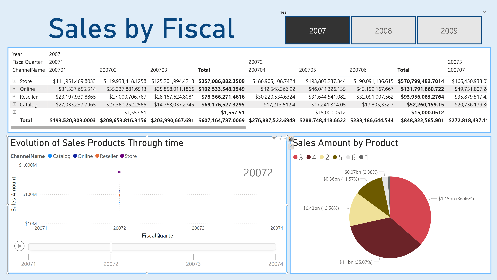

# Contoso Retail Business Intelligence Project

This repository contains a Power BI self-service analytics project built on the Contoso Retail dataset. It focuses on dimensional modeling, DAX-based KPI design, and interactive reporting for business performance analysis.

## Repository Contents

```text
.
|-- ContosoSelfServiceBI.pbix
|-- images/
|   |-- ContosoModel.png
|   |-- ProductsSalesByQuarter.png
|   |-- SalesByCalendar.png
|   |-- SalesByChannel.png
|   `-- SalesByFiscal.png
`-- README.md
```

## Project: Contoso Self-Service BI

Primary file: `ContosoSelfServiceBI.pbix`

### Scope
- Built a star schema with fact and dimension tables.
- Modeled relationships across sales, products, calendar/fiscal dates, stores, channels, promotions, and geography.
- Created hierarchical navigation (product, geography, and channel).
- Implemented DAX measures for sales, quantity, profit, and profit per day.
- Delivered interactive report pages with filtering, slicing, and drill-down analysis.

### Data Model


### Report Pages
Product Sales by Quarter  


Sales by Channel  


Sales by Calendar  


Sales by Fiscal Period  


## Requirements
- Power BI Desktop

## How to Open
1. Open `ContosoSelfServiceBI.pbix` in Power BI Desktop.
2. If prompted, update data source settings to match your local environment.
3. Refresh the model and explore report pages.

## Notes
- The raw dataset files are not included in this repository.
- If you open the PBIX on another machine, data source paths and credentials may need reconfiguration.

## Author
Cristiana Fonseca
